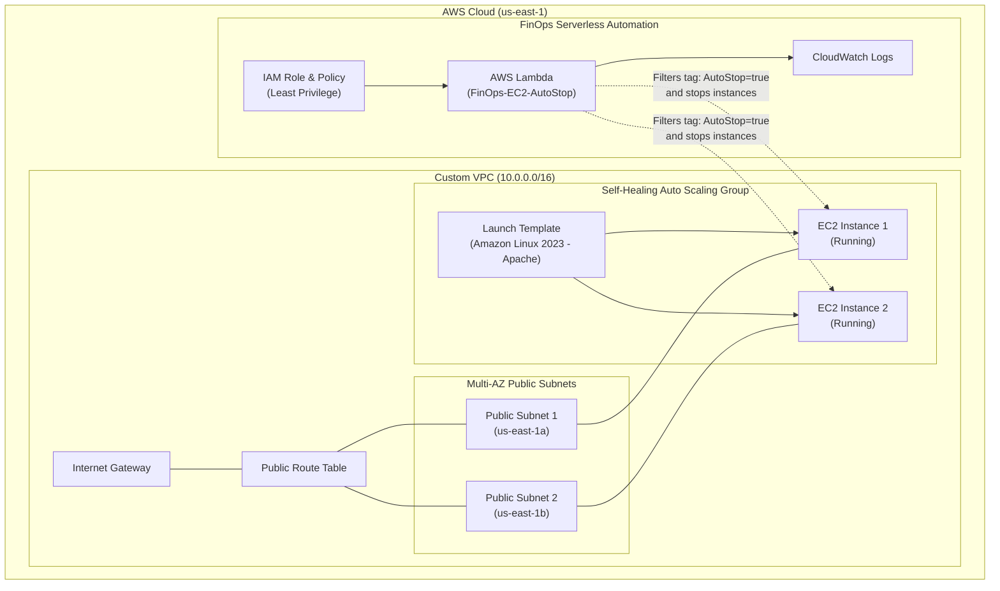

# AWS Self-Healing Infrastructure and FinOps Automation


An Infrastructure as Code (IaC) solution on AWS designed following the best practices of the **AWS Well-Architected Framework**. It integrates **high availability with self-healing recovery** and **automated cloud cost optimization (FinOps)**.

---

## Architecture and Components



### 1. Resilience and Self-Healing (Compute and VPC)
* **Multi-AZ Custom VPC:** Isolated network environment with two public subnets provisioned across independent Availability Zones (`us-east-1a` and `us-east-1b`), connected through an Internet Gateway and public route tables.
* **Security Pillar Compliance:** Security Group configured to allow inbound public HTTP traffic (port 80) and restrict SSH access (port 22) exclusively to the administrator's IP address.
* **Auto Scaling Group (ASG):** Configured with a desired and minimum capacity of 2 instances (scaling up to 4). If an instance experiences hardware or application failure, the ASG automatically terminates and replaces it without manual intervention.
* **Launch Template and Bootstrapping:** Standardized configuration based on Amazon Linux 2023 with an automated `userdata` shell script that updates packages, installs Apache HTTP Server, and deploys a health check page displaying the instance public IP.

### 2. FinOps and Cost Optimization (Serverless)
* **AWS Lambda Function (`FinOps-EC2-AutoStop`):** Automated serverless function built in Python 3.9 using the AWS SDK (`boto3`). It queries running EC2 instances dynamically and initiates stop actions on those tagged for scheduled shutdowns.
* **Resource Tagging Strategy:** Granular cost control driven by the `AutoStop = true` resource tag. Non-production or testing workloads are safely stopped outside operational hours to eliminate idle compute costs.
* **Least Privilege IAM Configuration:** Dedicated IAM execution role and policy granting only required actions: `ec2:DescribeInstances`, `ec2:StopInstances`, and CloudWatch log stream permissions (`logs:CreateLogGroup`, `logs:CreateLogStream`, `logs:PutLogEvents`).
* **Automated Packaging:** Terraform packages the Python source code dynamically into a deployment `.zip` archive on each execution using the `hashicorp/archive` provider.

---

## Project Structure

```text
aws-selfhealing-finops/
├── .gitignore                      # Git ignore definitions (tfstate, zips, cache)
├── README.md                       # Project documentation
├── scripts/
│   ├── lambda_function.py          # Python source code for the FinOps Lambda function
│   └── userdata.sh                 # Bootstrap script for EC2 instances
└── terraform/
    ├── environments/
    │   └── production/             # Deployment root for the production environment
    │       ├── main.tf             # Module orchestration (vpc, compute, finops)
    │       ├── outputs.tf          # Root outputs (VPC IDs, ASG ARNs, Lambda name, IAM)
    │       └── .terraform.lock.hcl # Provider dependency lock file
    └── modules/
        ├── compute/                # Launch Template and Auto Scaling Group module
        │   ├── main.tf
        │   ├── outputs.tf
        │   └── variables.tf
        ├── finops/                 # Serverless Lambda, IAM, and packaging module
        │   ├── main.tf
        │   ├── outputs.tf
        │   └── variables.tf
        └── vpc/                    # Networking module (VPC, Subnets, IGW, Route Tables, SG)
            ├── main.tf
            ├── outputs.tf
            └── variables.tf
```

---

## Prerequisites

Ensure the following tools are installed and configured before deployment:

1. **AWS CLI v2** configured with active credentials:
   ```bash
   aws configure
   ```
2. **Terraform** (v1.5 or newer):
   ```bash
   terraform version
   ```
3. **Python 3.9+** (optional, for local script testing).

---

## Deployment Guide

### 1. Clone the repository
```bash
git clone https://github.com/robpalacios1/aws-selfhealing-finops.git
cd aws-selfhealing-finops/terraform/environments/production
```

### 2. Initialize Terraform
Download required provider plugins (`aws`, `archive`) and initialize local modules:
```bash
terraform init
```

### 3. Validate configuration
Ensure configuration syntax and references are valid:
```bash
terraform validate
```

### 4. Review the execution plan
Inspect resources to be provisioned:
```bash
terraform plan
```

### 5. Apply the configuration
Deploy resources into your AWS account:
```bash
terraform apply
```
*Type `yes` when prompted to approve the execution.*

---

## Verification and Testing

### Test 1: Self-Healing Behavior
1. Open the **Amazon EC2 Console** and navigate to **Instances**.
2. Select one of the running instances launched by the Auto Scaling Group and choose **Terminate Instance**.
3. Observe how the Auto Scaling Group detects the capacity drop, initiates health checks, and launches a replacement instance automatically.

### Test 2: FinOps Cost Optimization (Auto-Stop)
1. Add the following tag to any target EC2 instance:
   * **Key:** `AutoStop`
   * **Value:** `true`
2. Invoke the Lambda function using the AWS CLI or the AWS Management Console:
   ```bash
   aws lambda invoke \
     --function-name FinOps-EC2-AutoStop \
     --region us-east-1 \
     response.json
   ```
3. Check `response.json` and review the output in **Amazon CloudWatch Logs**. The tagged instance will transition to the `stopping` state automatically.

---

## Resource Cleanup

To avoid ongoing AWS charges after testing:

```bash
cd terraform/environments/production
terraform destroy
```
*Type `yes` when prompted to tear down all managed infrastructure.*

---

## Author and License
* **Author:** Roberto Palacios ([@robpalacios1](https://github.com/robpalacios1))
* **Portfolio** ([Potfolio Web](https://robpalacios1.com))
* **Purpose:** Cloud architecture demonstration covering High Availability, Self-Healing infrastructure, and FinOps automation using Terraform.
